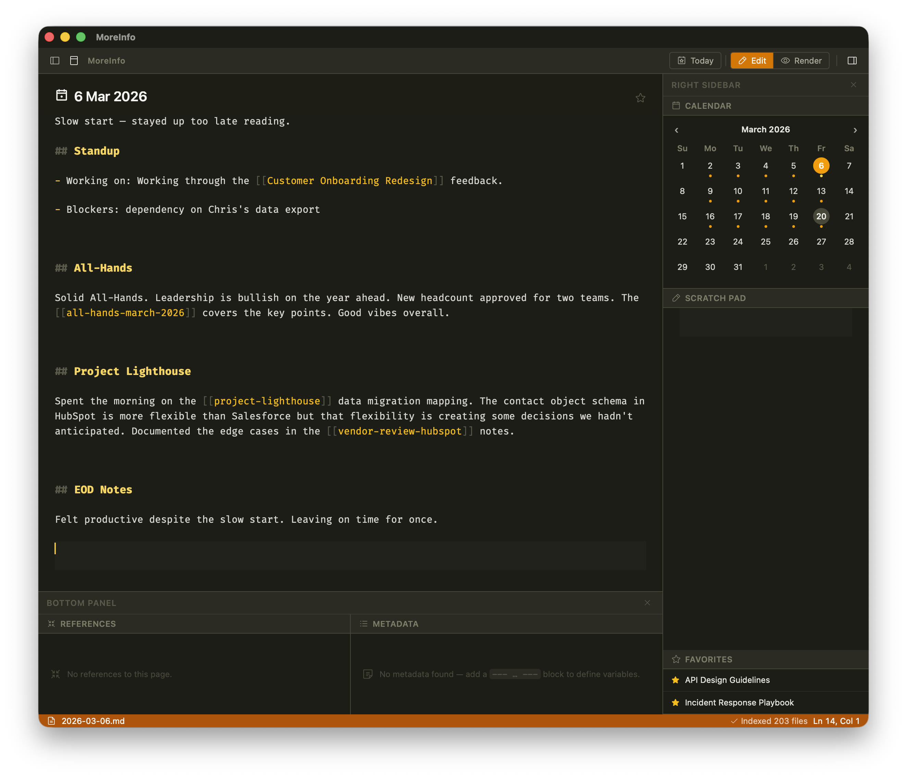
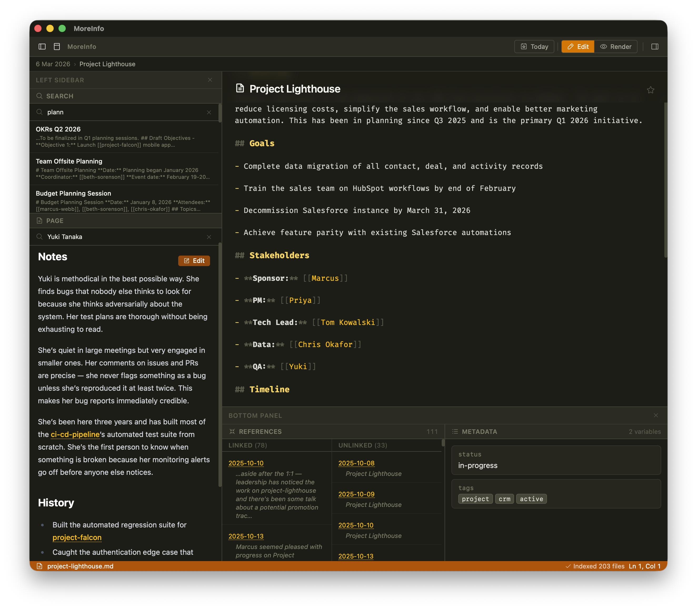

# MoreInfo

A markdown-based personal knowledge base (PKB) for macOS, with Windows and Linux planned; mobile to follow. MoreInfo combines a wiki-style linking system, daily journals, and task management — all backed by plain-text files you can read, edit, back up, and sync with any tool you already use.

> **Status: Early development.** Core editing and linking work. Tasks, templates, and several planned widgets are still in progress.

---

## Philosophy

- **Plain text is the source of truth.** Every note is a `.md` file on disk. The SQLite database is a derived cache for speed — delete it and it rebuilds itself.
- **Filenames don't matter to the user.** MoreInfo manages filenames; you work with titles and links.
- **Portable.** Your datastore is a folder. Move it, sync it with any cloud provider, or open it in any text editor. Nothing is locked away.

---

## Features

### Working now

- **Markdown editor** with syntax highlighting, wiki-link autocomplete, and a live split preview
- **Wiki-style linking** — `[[Page Title]]` links between notes; clicking creates the page if it doesn't exist. Supports CamelCase as links to existing content.
- **Backlinks** — linked and unlinked references shown at the bottom of every page
- **Daily journals** — one `.md` file per day, named `YYYY-MM-DD.md`; today's journal opens on launch
- **Page aliases** — multiple names can resolve to the same page
- **Favorites** — star any page; favorited pages appear in the Favorites widget
- **@calc blocks** — tape-calculator arithmetic and unit math / conversions inside any page or the Scratch Pad (see below)
- **Full-text search** with SQLite FTS5
- **Metadata** — YAML-style front matter anywhere in the file, plus end-of-file sig-block metadata; supports string, date, boolean, and array types
- **Tags** via metadata
- **Sidebar layout** — resizable left, right, top, and bottom sidebars can hold widgets in a VS Code-style arrangement
- **Widgets**: Calendar, Metadata, References, Counter, Page, Browser, Search, Favorites, Scratchpad
- **Page templates** — scaffold new pages from a template
- **Outline widget** — heading-based document outline
- **Categories** — single-value taxonomy of pages that classify the type of content represented by the page
- **Annotations** - In-line markers (FIXME, IDEA, NOTE, TODO) that highlights and indexes thoughts and ideas that are not tasks
- **Filesystem watcher** keeps the database in sync with changes made outside the app
- **User preferences** stored in `preferences.json` inside the datastore (travels with your data)

### Partially implemented

- **Task management** — `[ ]` checkboxes render as clickable UI; checking stamps `@done(timestamp)` automatically. GTD-style `@context` tags on task lines are highlighted and indexed. Due dates, priorities, repeating tasks, and the Tasks widget are still planned.

### Planned / in progress

- **Tasks widget** — filtered view of all open tasks across the datastore
- **Static site export** — publish some or all notes as a website
- **Focus mode** — distraction-free single-document view
- **iOS / iPadOS binaries** (Tauri roadmap dependent)

---

## @calc blocks

Any page (including the Scratch Pad widget) can contain one or more calculator blocks. Start a block by placing `@calc` alone on a line. Every subsequent non-blank line is treated as an arithmetic expression. The block ends at the first blank line (or end of file).

```text
@calc
450 * 12
+ 1200
* 1.08
```

Results appear flush-right in the editor and in the preview pane and are selectable for clipboard copy.

### Implicit carry and `_last`

The result of each expression is stored in a variable called `_last` and silently carried forward as the left operand of the next line **when that line begins with a binary operator** (`+`, `-`, `*`, `/`, `%`, `**`, `^`) or a unit-conversion keyword (`in`, `to`). A line that starts with a number or function is evaluated independently.

| Line | Interpretation |
| --- | --- |
| `450 * 12` | standalone: `450 × 12 = 5,400` |
| `+ 1200` | carry: `5,400 + 1,200 = 6,600` |
| `* 1.08` | carry: `6,600 × 1.08 = 7,128` |
| `32^2` | standalone (starts with a number): `1,024` |

A leading `-` is always treated as binary subtraction (subtract from the previous result), not unary negation.

`_last` is always in scope and can be used explicitly in any expression:

```text
@calc
144
sqrt(_last)
_last^2
(_last + 10) / 2
```

### Supported syntax

Expressions are evaluated by [math.js](https://mathjs.org), which supports a broad range of syntax:

| Feature | Examples |
| --- | --- |
| Basic operators | `+ - * / % ** ^` (`^` is an alias for `**`) |
| Grouping | `(2 + 3) * 4` |
| Constants | `pi`, `e` |
| Functions | `sqrt`, `abs`, `round`, `floor`, `ceil`, `min`, `max`, `log`, `log2`, `log10`, `sin`, `cos`, `tan`, `asin`, `acos`, `atan`, `exp`, `sign`, `gcd`, `lcm`, and [many more](https://mathjs.org/docs/reference/functions.html) |

`[[Wiki links]]` and CamelCase page references on a calc line are ignored during evaluation — they are stripped before the expression is parsed, so you can annotate a value with its source page without affecting the result.

### Unit math

Calc blocks understand physical units and can perform unit-aware arithmetic and conversions, powered by math.js.

```text
@calc
2 * 5 miles
5 miles / 10 days
2 miles in km
60 mph * 2.5 hours
```

A line beginning with `in <unit>` or `to <unit>` converts `_last` to the new unit:

```text
@calc
26.2 miles
in km
to meters
```

Units carry through arithmetic — the result of `5 miles / 10 days` is `0.5 miles / day`, not a dimensionless number. Incompatible unit operations (e.g. `10 miles + 5 kg`) produce a **Unit error** rather than a silent wrong answer.

---

## Screenshots

Main window, daily journal:


Page open with sidebar widgets:


---

## Tech stack

| Layer | Technology |
| --- | --- |
| Application framework | [Tauri v2](https://tauri.app) |
| Backend | Rust (2021 edition) |
| Frontend build | [Vite](https://vitejs.dev) |
| Editor | [CodeMirror 6](https://codemirror.net) |
| Styling | [Tailwind CSS v4](https://tailwindcss.com) |
| Icons | [Phosphor Icons](https://phosphoricons.com) |
| Markdown parsing (Rust) | [pulldown-cmark](https://github.com/raphlinus/pulldown-cmark) |
| Metadata parsing (Rust) | Custom `front-matter` crate (local) |
| Database | SQLite via [rusqlite](https://github.com/rusqlite/rusqlite) |
| Date parsing (JS) | [chrono-node](https://github.com/wanasit/chrono) |
| Calc expression engine | [math.js](https://mathjs.org) |

---

## Building

### Prerequisites

- [Rust](https://rustup.rs) (stable toolchain)
- [Node.js](https://nodejs.org) 18 or later
- macOS 12+ (primary target; Windows/Linux builds untested but planned)
- Tauri CLI: installed automatically via `npm install`

### Development

```bash
git clone https://github.com/eafarris/MoreInfo.git
cd MoreInfo
npm install
npm run dev
```

`npm run dev` starts the Vite dev server and the Tauri development window together. Tailwind CSS is processed automatically by the Vite plugin — no separate build step needed.

### Production build

```bash
npm run build
```

This runs `vite build` followed by `tauri build` and produces a signed `.app` bundle (macOS) in `src-tauri/target/release/bundle/`.

---

## Datastore layout

By default the datastore lives at `~/Documents/MoreInfo`. The location can be overridden in `~/Library/Application Support/MoreInfo/moreinfo.json`.

```text
~/Documents/MoreInfo/
  journal/          # YYYY-MM-DD.md daily journal files
  wiki/             # general-purpose pages
  templates/        # page templates
  preferences.json  # per-user preferences (travels with the datastore)
  moreinfo.sqlite   # derived cache — safe to delete; rebuilds on launch
```

---

## Built with Claude Code

MoreInfo is being developed in collaboration with [Claude Code](https://claude.ai/claude-code), Anthropic's agentic coding tool. The architecture decisions, feature design, and prose in `CLAUDE.md` are the author's; the implementation is largely written by Claude Code working from those specifications.

---

## About the name

I'm an [Apple Newton](https://en.wikipedia.org/wiki/Apple_Newton) fan, and used one well past its useful life. [SilverWARE](https://silverwaresoftware.com/AboutUs.shtml) made a PIM extension for the default Newton apps that was called [MoreInfo](https://silverwaresoftware.com/MI5PR.shtml), and it was truly the finest piece of software I've ever used. The name of this project is aspirational. My MoreInfo covers similar ground in a modern context, and I want it to be worthy of the name.

---

## License

Not yet decided. Source is public for reference. If you're interested in using or contributing, open an issue.
